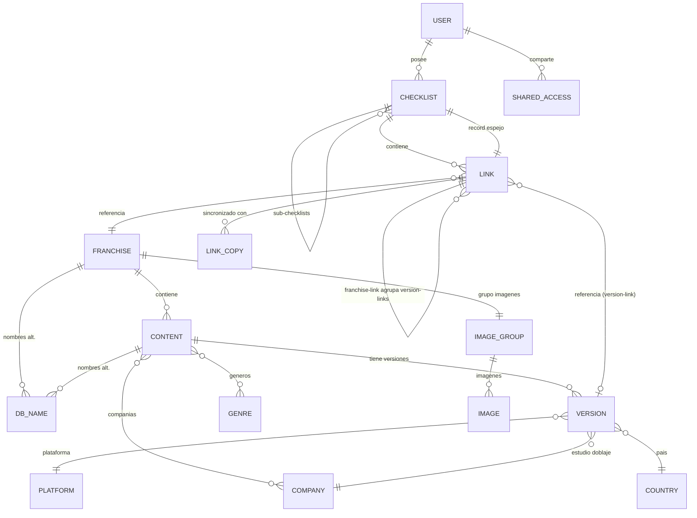

# 02 — Análisis del Backend Odoo (repositorio `ll-odoo`)

> Fuente: rama `checklist_base` (commit `9ba6b0e`, 2026-05-24). La rama `master`
> está desactualizada (versión primitiva del módulo). **Trabajar siempre contra
> `checklist_base`** hasta que se mergee.

## Infraestructura

- **Odoo 17.0** en Docker (`FROM odoo:17.0`), detrás de proxy (`--proxy-mode`),
  puerto por env `PORT`, Postgres externo por envs `ODOO_DATABASE_*`.
- `--init=all` en cada arranque (reinstala módulos siempre — decisión del dev
  backend, no nos afecta).
- Módulos propios: `ll_checklist` (el producto), `ll_oauth` (login social),
  `ll_webpage` (stub vacío — un controlador `/` comentado; señal de que el dev
  planeaba servir una página web desde Odoo).

## Los tres módulos

### `ll_oauth`
- Extiende `auth.oauth.provider` con `ll_oauth_extra_params` (parámetros extra
  en la URL de autorización — típico para pedir scopes/claims de Twitch).
- Extiende `res.users._auth_oauth_signin`: al entrar por OAuth sincroniza
  `preferred_username` → nombre, `email` → login/email, `picture` → avatar.
  Esos claims son exactamente los que devuelve el OIDC de Twitch.

### `ll_webpage`
- Vacío (controlador comentado). Confirma que **no existe hoy ninguna API HTTP
  pública ni página web**: todo el producto vive en el backoffice de Odoo.

### `ll_checklist` — el producto

## Modelo de datos completo

### Capa "master" (datos maestros, cargados por admin)

| Modelo Odoo | Campos clave | Notas |
|---|---|---|
| `ll.checklist.genre` | `genre_name`, `genre_color` (int 1–11) | Colores del sistema de tags de Odoo; el frontend tendrá que mapear int → color propio |
| `ll.checklist.company` | `company_name`, `company_type_id` | Ej.: estudio de animación, distribuidor, desarrolladora |
| `ll.checklist.company.type` | `ct_name` | Tipos libres de compañía |
| `ll.checklist.platform` | `platform_name`, `platform_image_binary` | Plataforma de juego o streaming |
| `ll.checklist.country` | `country_name`, `country_image_binary`, `country_language_id` | Se usa en versiones (país/idioma de la release) |
| `ll.checklist.image.group` | `ig_description`, `ig_franchise_id` | Cada franquicia crea su grupo de imágenes automáticamente |
| `ll.checklist.image` | `image_group_id`, `image_name`, `image_binary` | Todas las imágenes son binarios en DB, servidos vía `/web/image?model=...&id=...&field=image_binary` |

### Capa "database" (el catálogo)

**`ll.checklist.franchise`** — la entidad raíz (ej. "Fullmetal Alchemist"):
- `franchise_main_name_id` / `franchise_name_ids` → nombres alternativos
  multiidioma (modelo `ll.checklist.db.name`), uno marcado como principal.
- `franchise_description` (requerido), `franchise_published` (flag de visibilidad),
  imagen + grupo de imágenes propio (auto-creado en `create()`).
- Hijos: `franchise_game_content_ids` y `franchise_video_content_ids`
  (particiones del mismo One2many `content` por tipo).

**`ll.checklist.content`** — una obra dentro de la franquicia (ej. "FMA: Brotherhood"):
- `content_type`: `G` (Game) | `V` (Video). **No hay tipo lectura/manga.**
- `content_video_type` (solo videos): `C` Compilation, `M` Movie, `OVA`, `ONA`,
  `S` Special, `TV`. → Aquí viven "series", "películas" y "anime" del brief.
- `content_genre_ids` (M2M), `content_company_ids` (M2M), `content_abbreviation`
  (ej. "S1" — se usa en la agregación de progreso), `content_order`,
  `content_published`, nombres alternativos igual que franchise, imagen propia
  (del grupo de la franquicia), `content_description` (requerido).
- Hijos: `content_version_ids`.

**`ll.checklist.version`** — la unidad trackeable (ej. "Temporada 1 doblada al latino"):
- `version_name`, `version_episodes` (int, default 1; `0` significa "en emisión /
  desconocido" — ver `compute_show_name` que muestra `-` cuando es ≤ 0),
  `version_date` (fecha de estreno, requerida), `version_country_id`,
  `version_dubbing_studio_id` (company), `version_platform_id`,
  `version_published`, `version_order`.

**`ll.checklist.db.name`** — nombres alternativos:
- `db_name`, `db_language_id` (res.lang), apunta a franchise **o** content.
- Al vincular al checklist, el usuario **elige con qué nombre** mostrar el ítem.

### Capa "usuario"

**`ll.checklist.user`** — perfil por usuario Odoo (auto-creado on-demand):
- `user_res_user_id` (M2O a res.users, único), `user_checklist_ids` (solo raíces),
  `user_shared_access_ids` (modelo `shared.access`: IDs de usuarios con acceso).

**`ll.checklist.checklist`** — lista del usuario, jerárquica:
- `checklist_name`, `checklist_fullname` (computado: `Padre >> Hijo`),
  `checklist_description`, `checklist_order`, imagen.
- `checklist_type`: `S` Sub-Checklist (carpeta) | `R` Record (ítem hoja).
- `checklist_sorting_mode`: `C` Custom | `N` Name.
- `checklist_published` (visible públicamente), `checklist_shared` (default True).
- `checklist_database` (bool): True cuando el nodo fue creado por un Link (o sea,
  representa un ítem del catálogo y no una carpeta manual del usuario).
- Árbol vía `checklist_parent_id` / `checklist_sub_checklist_ids`.

**`ll.checklist.link`** — LA pieza central del tracking. Une catálogo ↔ checklist:
- Dos variantes (`link_type` computado):
  - **Franchise Link (`F`)**: agrupa varios version-links de una misma franquicia
    dentro de una checklist. Muestra progreso agregado por abreviación:
    `Naruto [S1 12/12] - [S2 03/24]` (orden por `lv_record_order`, formato en
    `compute_show_name`). Flag `lf_show_episodes` para ocultar el progreso.
  - **Version Link (`V`)**: un ítem concreto. `lv_episodes` = episodios vistos
    (progreso del usuario), `lv_abbreviation` (hereda la del content),
    `link_name` = nombre elegido, `link_show_name` computado `Nombre [03/12]`.
- Cada link crea/posee un nodo `checklist` espejo (`link_record_id`) — el árbol
  de checklists ES la vista materializada de los links. Escribir en el link
  propaga al record (orden, descripción, imagen, nombre).
- `link_content_type` (`G`/`V`) — una franquicia puede tener dos franchise-links
  distintos en la misma checklist: uno para juegos y otro para videos.
- **`ll.checklist.link.copy`**: pares de links sincronizados (mismo ítem en dos
  checklists; progreso/abreviación espejados en `write()`).

**`ll.checklist.wizard.link`** — TransientModel (wizard del backoffice) con el
flujo de vinculación. Importante porque **el frontend debe replicar este flujo**:
1. Usuario dispara "agregar a checklist" desde un content o una version.
2. Si el content tiene una sola versión, se preselecciona; si no, se elige.
3. Se elige checklist destino, nombre a mostrar (de los alternativos), y si se
   agrupa bajo un franchise-link (creándolo si no existe, con su propio nombre).
4. Existe modo "copia sincronizada" a partir de un link existente.

## Diagrama ER (simplificado)

## Semántica no obvia (leída del código, no documentada)

1. `version_episodes <= 0` ⇒ total desconocido/en emisión; la UI muestra `[03/-]`.
2. El progreso agregado de un franchise-link agrupa por `lv_abbreviation`
   (los version-links con la misma abreviación suman episodios juntos).
3. Borrar un link borra su record espejo; borrar el último version-link de un
   franchise-link borra también el franchise-link (`action_remove`).
4. `checklist_shared` default True pero el commit `26209c9` dice "Shared User
   Option Disabled" — feature a medio hacer; no apoyarse en él.
5. Los nombres alternativos tienen idioma (`res.lang`), así que el frontend puede
   ofrecer "mostrar títulos en japonés/inglés/español" a futuro.
6. Género usa colores enteros de Odoo (1–11): definir en frontend una paleta
   propia indexada 1–11 para ser consistente con el backoffice.

## Gaps: brief vs backend real

| Feature del brief | ¿Backend? | Comentario |
|---|---|---|
| Estados fijos (Watching/Completed/…) | ❌ | El equivalente son checklists creadas por el usuario |
| Rating personal 1–10 | ❌ | No hay campo en `link` |
| Notas privadas por ítem | ❌ | `link_description` existe (hereda al record) — podría reutilizarse como "notas" ✔️ parcial |
| Fechas de inicio/fin | ❌ | No hay campos |
| Progreso episodios | ✅ | `lv_episodes` / `version_episodes` |
| Score comunitario + distribución | ❌ | No hay agregación ni ratings |
| Reviews de usuarios | ❌ | Nada |
| Recomendaciones | ❌ | Nada |
| Manga/lectura | ❌ | `content_type` solo `G`/`V` |
| Catálogo con filtros | ✅ parcial | Datos existen (género, año vía version_date, plataforma, tipo); falta API |
| Búsqueda | ✅ parcial | Nombres alternativos ayudan; falta API |
| Perfil público | ✅ parcial | `checklist_published`; falta API y stats |
| Auth | ✅ | OAuth Twitch + usuarios Odoo; falta flujo para SPA |
| API para el frontend | ❌ | **No existe nada. Es el bloqueo principal.** |

## Riesgos detectados

1. **Sin API**: el dev backend tiene que escribir controladores HTTP (o exponer
   JSON-RPC). Hasta entonces, MSW. → doc 08 tiene las preguntas.
2. **Modelo en movimiento**: commits activos re-estructurando (links, nombres,
   companies/platforms son de los últimos commits). El contrato API (doc 04)
   debe acordarse pronto para congelar la superficie.
3. **Imágenes como binarios en DB** servidos por `/web/image`: URLs dependen de
   sesión/ACL de Odoo. Hay que confirmar acceso público (doc 08, pregunta 7).
4. **`--init=all` + `--without-demo`**: cada deploy reinstala módulos; si el dev
   resetea la DB, el catálogo de prueba desaparece. Motivo extra para que el
   frontend no dependa del backend en desarrollo.
